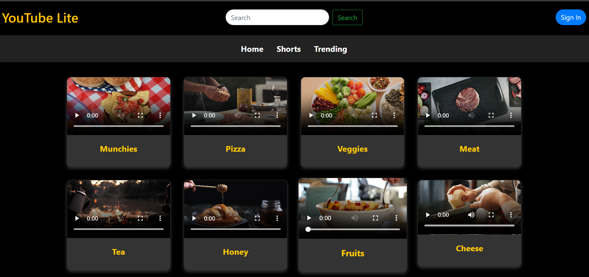
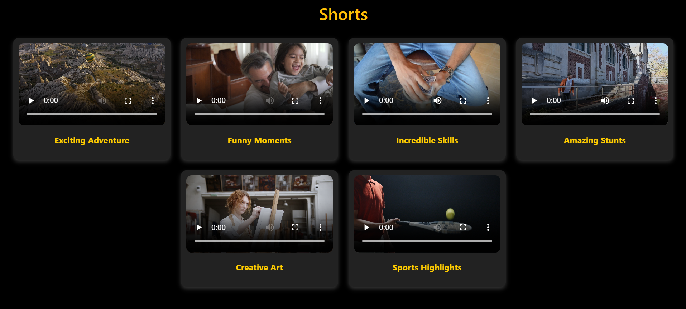
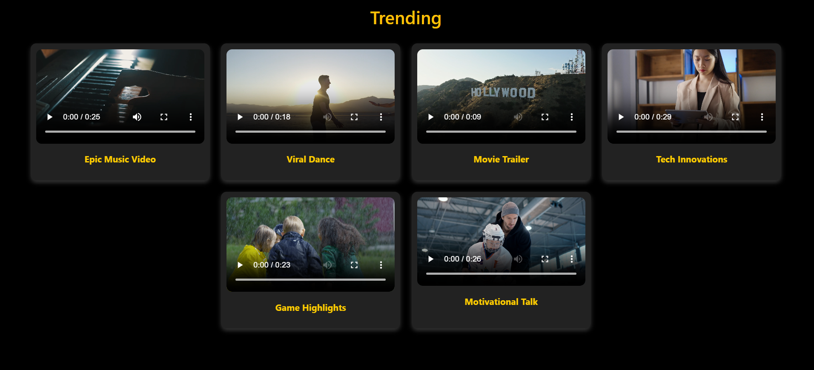

# YouTube Lite 🎥

A **lightweight and beautiful** YouTube-inspired video platform where users can browse, watch, and enjoy short videos and trending content. Built with **HTML, CSS, Bootstrap**, this project aims to provide a **smooth, elegant, and responsive** user experience. 🚀

---

## 🌟 Features

✅ **Home Page** – Displays a collection of engaging videos in a card format.  
✅ **Shorts Page** – Showcases vertical short videos in a flexible grid layout.  
✅ **Trending Page** – Lists the hottest and most popular videos.  
✅ **Responsive Design** – Fully optimized for desktops, tablets, and mobiles.  
✅ **Search Bar** – Allows users to search for their favorite videos.  
✅ **Bootstrap Integration** – Ensures a clean and modern UI.  

---

## 🛠️ Technologies Used

- **HTML5** – Structuring the web pages.
- **CSS3 & Bootstrap 4.6** – Styling and responsive layout.


---

## 📸 Screenshots

 |
 | 
 |


---

## 🚀 How to Run

1️⃣ Clone the repository:  
```sh
 git clone (https://github.com/Sakshi-2508)
```
2️⃣ Navigate to the project directory:  
```sh
 cd youtube-lite
```
3️⃣ Open **index.html** in your favorite browser or run a local server:  
```sh
 python -m http.server 8000
```
4️⃣ Visit [(https://github.com/Sakshi-2508)] to explore YouTube Lite! 🎉

---

## 📂 Folder Structure
```
📂 youtube-lite
 ├── 📁 videos         # Video files
 ├── 📁 screenshots    # Screenshots for README
 ├── 📄 index.html     # Main home page
 ├── 📄 shorts.html    # Shorts video page
 ├── 📄 trending.html  # Trending videos page
 ├── 📄 styles.css     # Custom styles (if any)
```

---

## 💡 Future Improvements

🔹 **User Authentication** – Sign in & Sign out functionality.  
🔹 **Like & Comment System** – Engage with the content.  
🔹 **Dark/Light Mode** – Toggle between themes.  
🔹 **Dynamic Video Uploads** – Upload and share videos.

---

## 👨‍💻 Contributing

Feel free to **fork** this repository and contribute! PRs are always welcome. 😊

---

## 📝 License

This project is **open-source** and available under the **MIT License**.

---

### 🎉 Made with ❤️ by [Sakshi]

